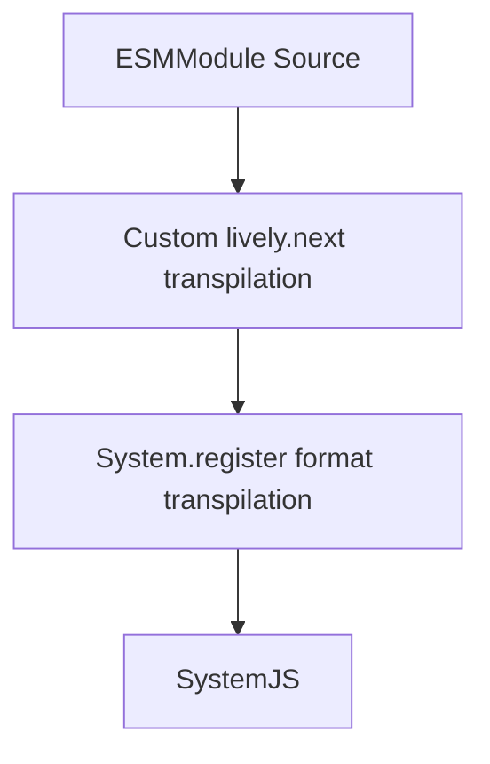
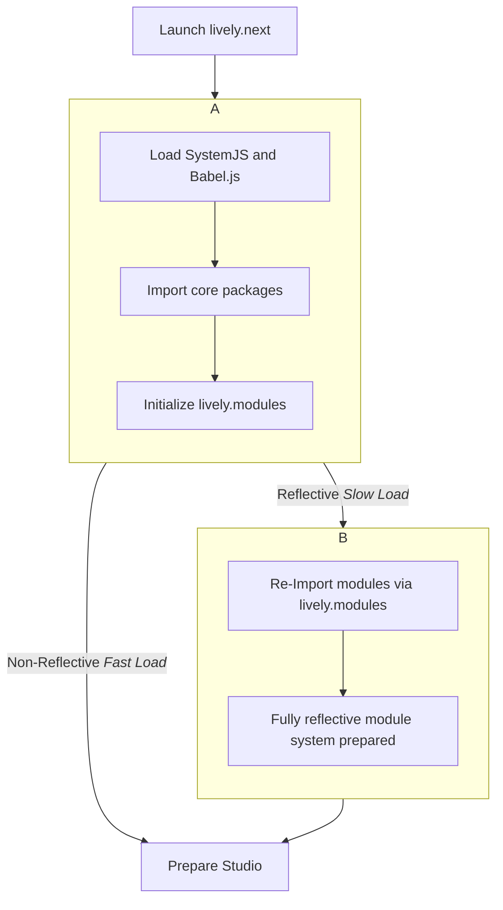
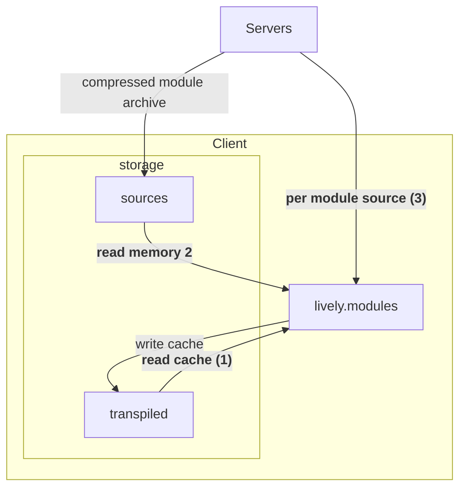

> ⚠️ **Attention**
>
> The following article is of very technical nature and only suitable for people who are interested in learning more about the inner workings of `lively.next`.

`lively.next` draws inspiration from Smalltalk, aiming to provide a flexible, efficient, and interactive coding experience. The following chapter outlines the key features and mechanisms of `lively.next`, highlighting its advanced class management, source transformations, module system, performance optimizations for loading the system, and bundling techniques.


## Transpilation in lively.next

Since `lively.next` lives in the Browser and `Node.JS` run-times, it does not have the luxury of a pure Smalltalk system where scopes and run-time stacks are first class objects or mutable classes are already built into the system core. Instead we need to tweak the default behavior of `JavaScript` with a little sprinkle of transpilation magic. ✨

### Scope

The first area of concern are evaluation scopes. In `JavaScript` a scope is defined syntactically but cannot be accessed easily programmatically after the fact, especially not in the browser. For instance, evaluating variable declaration like `var foo = "bar";` manually will not populate some kind of local namespace. Likewise, we cannot access variables from other scopes unless we have them explicitly stored away in a dedicated object.

This is especially troubling when considering tools like the **Workspace** or the **System Browser**, where we operate on a module scope and would like to have the ability to flexibly evaluate expressions within the context of the module.
To alleviate that, `lively.next` provides a scope capturing transpilation for modules that is transparent to the user. It covers:

- Class declarations.
- Function declarations.
- Constants, or other top level variables, especially *Component Definitions*.

These entities inside of the written source-code are then rewritten to be captured by a synthesized recording object that keeps all declared variables stored transparent to the user. So a module scope that on the surface looks something like this:

```javascript
const foo = 'bar';

function alice() { returns 'bob' }
```

Internally turns into something like the following:

```javascript
const foo = __rec.foo = 'bar';

__rec.alice = function alice() { returns 'bob' }
// also attach meta information to functions
__rec.alice[Symbol.for('lively-module-meta')] = {
  sourceLocation,
  package: { module }
  ....
}
```

Without going into too much detail, there are also more advanced scope capturing transformations. For instance in the presence of destructuring declarations the following happens:

```javascript
const { ...bar, key } = foo;

// is transformed to:
let destructured_1 = {
  key: 42,
  hello: "foo",
  world: "bar"
};
__rec.key = destructured_1.key;
var bar = __rec.bar = {};
for (var __key in destructured_1) {
  if (__key === "key")
    continue;
  bar[__key] = destructured_1[__key];
}
```

### Classes

The objective of `lively.next`s class system is to replicate a Smalltalk-like class object within its run-time. In Smalltalk, when a class definition is modified, the change is applied in place, allowing all instances of the class to immediately reflect the updated behavior. In contrast, `JavaScript`'s default behavior, whether using the new ECMAScript class syntax or the traditional function prototype approach, replaces the existing class with the new definition. To achieve a Smalltalk-like system with live updates in `lively.next`, it's essential to alter this default evaluation method.

To ensure that redefining a class does not replace the existing class instance but instead patches it with the new definition, the classes are transformed into a function call that synthesizes a new class based on a preexisting version and includes the necessary class members, such as methods and static methods and getters.

```javascript
class Foo extends SuperFoo {
  m() { return 2 + super.m() }
}

// is converted into something like:
 createOrExtend(recorder, {referencedAs: "SuperFoo", value: SuperFoo}, "Foo2", [{
   key: "m",
   value: function m() {
     return 2 + this.constructor[superclassSymbol].prototype.m.call(this);
   }
 }])
```

The `createOrExtend` function in the above transformation consequently checks if a class object is already present in the scope recorder and if so, continues to extend the class instead of replacing it.

Additionally, the class object needs to be equipped with meta-information about itself, including details about its properties, superclass, module it is defined in, and package it belongs to. 
Meta information about the properties within classes can be derived by using a canonical `static get properties() { }` definition, allowing for declarative property definitions. This setup facilitates the specification of property dependencies, default values, custom initialization routines, and other helpful meta-information for tool inspection, such as type and read-only status. Below is a schematic overview of how such a definition can look like:

```javascript
// example of a class definition with static properties
class Foo  extends SuperFoo {
  static get properties () {
    return {
       caption: {
          defaultValue: 'Default caption', // does not invoke the setter when initialized to this value
          initialize(v) {
            // passed the defaultValue as the first argument if defined
          }
          set(v) {
            // allows to override the default setter
          },
          get() {
            // allows to override the default getter
          },
          before: [...], // list of properties that have to be initialized before
          after: [...] // list of properties that can be initialized after 
          ...
       },
       ...
    }
  }
}
```

> **💡 Tip**
>
> Remembering this concept of `static get properties() { }` is important, for example when working with `ViewModel`s. See our [introduction](#explanations/morphic) to working with `ViewModel`s.

Every other piece of meta information on the other hand is generated during transpilation since the transpiler has all the meta information at hand already so that it can be attached to the initialized class. It is then passed to the `createOrExtent()` function from earlier like so:

```javascript
 createOrExtend(recorder, {referencedAs: "SuperFoo", value: SuperFoo}, "Foo2", [{
   key: "m",
   value: function m() {
     return 2 + this.constructor[superclassSymbol].prototype.m.call(this);
   }
 }], {
   package: { module },
   sourceLocation,
   ...
 })
```

### Dynamic Code Evaluation

In Smalltalk-like systems, a crucial feature is the pervasive capability to evaluate expressions. This concept is rooted in the influences of `LISP`-like systems from which Smalltalk drew inspiration. In `JavaScript`, the standard `eval()` function has a number of peculiarities that can complicate its practical use. Notably, the evaluation context is tied to the local scope of the function from which it was invoked. Additionally, there are several other specific rules and behaviors associated with `eval()`, which are outlined in detail on resources like the [Mozilla Developer Network](https://developer.mozilla.org/en-US/docs/Web/JavaScript/Reference/Global_Objects/eval).

To address these limitations, the `lively.next` framework offers a custom wrapper around `JavaScript`'s native `eval()` function. This wrapper applies unique source transformations, thereby providing a more predictable and flexible evaluation behavior. It allows for custom bindings to be provided alongside the code being evaluated, offering various styles of evaluation:

1. **Custom Variable Mapping Evaluation**: This allows variables in the expression to be manually assigned specific values, enabling tailored execution contexts.

2. **Module-Based Evaluation**: Here, the variables of a module scope captured during custom transpilation are made available to the expression. This setup also supports the evaluation of partial module-specific expressions, such as `import` or `export` statements. This functionality is not available with the native `eval()` and is achieved by transforming module-specific syntax into statements that correctly access values from the module's `recorder` object.

3. **Remote run-time Evaluation**: This environment supports evaluation in separate run-times, such as different browsers, servers, or `lively.next` instances running on different hardware. The source transpilation process ensures that all necessary modules and packages are imported, enabling the evaluation to proceed smoothly in the different environment.

## Modules in lively.next

The modules system in `lively.next` is its own spin on the now widely adopted [EcmaScript Module System](https://developer.mozilla.org/en-US/docs/Web/JavaScript/Guide/Modules). It provides a fully reflective interpretation of the former, allowing for run-time inspection and modification of each and every modules in the system. In the following we will go over the different technical bits that play a key role in its implementation.

> **📜 Behind the Scenes**
>
> Some of the spins on the native module system have historical reasons, as `lively.next` adopted this before its comprehensive success was a done deal. For this reason, we also use our own package abstraction, something that is still quite unique. As deviating from the widely-adopted best-practices in this way comes with some downsides, especially additional maintenance work, we are investigating solutions that build more on well-treated paths.  

### `SystemJS`

[`SystemJS`](https://github.com/systemjs/systemjs) is a framework that was developed in parallel with the early drafts of the EcmaScript Module System proposal. Over time, it has consistently aligned with the evolving semantics and changes of the standard, adapting through various iterations until the standard reached its current form. The core idea behind `SystemJS` was to offer a functional implementation of the standard as early as possible, thereby facilitating the adoption of JavaScript modules across the broader JavaScript ecosystem.

Given that native syntax support for modules was not yet available in browsers during its inception, `SystemJS` provided an alternative programmatic format that was semantically equivalent to the ECMAScript Module (ESM) System. This was complemented by an easily adaptable transpilation interface, enabling developers to convert ESM syntax into a format compliant with `SystemJS`.

Today, `SystemJS` is particularly valuable for the dynamic development of `JavaScript` module-based applications. It includes a convenient hot-swapping engine that allows for a dynamic live development in the browser.

In the case of the `lively.next` framework, `SystemJS` serves as the foundation for implementing various custom features that native `JavaScript` modules do not support. This is accomplished by integrating the aforementioned custom transpilation logic as a plugin into `SystemJS`. In addition to the unique transformations specific to `lively.next`, we also perform a final transpilation step to transpile the ESM module syntax into a format that `SystemJS` can process. The transpiled module code is then managed by `SystemJS`, which handles the necessary bookkeeping to ensure the proper functioning of the module system.



### Modules and Files

In essence, modules are ultimately based on files that are stored somewhere on a computer. For the core modules of `lively.next` (such as `lively.modules`, `lively.morphic`, etc.), these files are located within the local file system where the `lively.server` is running. By default, `lively.next` requests these source files from the server, which retrieves the files and sends their contents back to the client. When a module is modified from the client side, the corresponding file is eventually updated in the file system.

However these are not only only types of modules we use. There are broadly four types of modules encountered in `lively.next`:

1. **Core Modules**: These are part of the core packages of `lively.next`. These modules can be modified to evolve the system at run-time.

2. **Project-Specific Modules**: These are modules related to projects currently being developed in `lively.next`. You are very welcome to edit these modules of course! These are all files that reside in a folder inside of the `local_projects` folder in your `lively.next` repository.

3. **Third-Party Modules via `flatn`**: These modules are installed through the custom NPM package manager [`flatn`](https://github.com/rksm/flatn). Although technically modifiable, it is generally advised not to alter these modules. Many of these NPM packages do not ship as ECMAScript Modules (ESM) and can only be reliably used within a `Node.js` environment. This limitation arises because `lively.next` currently provides native fallbacks for non-ESM modules exclusively in the `Node.js` context. However, using native fallbacks results in a loss of reflection capabilities for these modules. For reliable import of third-party modules in the browser, a different approach is needed.

4. **Third-Party Modules via Public ESM Transpilation Services**: These are public servers that provide ESM-transpiled versions of NPM packages. This method enables approximately 90% of NPM packages intended for browser use to be imported directly into the browser. While there may be occasional bugs or issues, they can often be reported to the administrators of these servers, who are usually prompt in addressing the problems. To enhance loading performance, these modules are cached as files on the server file system of `lively.next`. Although technically possible, altering these modules is generally not recommended.

In addition to file-based modules, `lively.next` also supports in-memory modules. These can be stored in the browser's local storage (`local://...`) or kept entirely in memory (`lively://...`), disappearing once the run-time is terminated. An example of these ephemeral modules includes those created by workspaces within the system. In memory modules can also be serialized, meaning they can be incorporated into a snapshot which can be handy to transport state and behavior across different systems. See our [explanation on `lively.project`s](#explanations/projects) for some more information on snapshots.
 
### Bootstrapping the Module-System

In `lively.next`, modules are fully reflective, meaning each module object contains all the information it needs about its position within the system, the source code it holds, and the methods to update or reload itself. This level of introspection is not natively supported by either the Browser or the `NodeJS` run-time, making it essential to establish a bootstrapping process that initializes the module system before any module imports occur. 

The bootstrapping process is meta-circular, meaning it is defined entirely within `lively.next`. Here's a breakdown of the process:

**Step A** involves ensuring that all necessary third-party libraries, particularly `SystemJS` and [`Babel`](https://babeljs.io/), are loaded first. These libraries are crucial for the functioning of the system. Note, that a future goal is to remove `Babel` and its extensive dependencies, as it is currently used only for ESM to `SystemJS` transpilation. After loading these libraries, all core packages required for the `lively.modules` package are imported, followed by the initialization of the `lively.modules` package itself.

**Step B** utilizes the now initialized `lively.modules` package to re-import the previously imported packages along with any remaining necessary packages. This re-importation process is critical to achieve a fully reflective state within the module system.

It is important to note that the code described in the steps above is not executable on its own because there needs to be an initial module system in place to start importing anything. This issue is resolved by bundling the bootstrapping algorithm, where the steps in **Step A** become static imports resolved by the bundler. This setup provides enough infrastructure to enable the actions described in **Step B**.

Here is a diagram illustrating the bootstrapping process:



### Fast vs Slow Loading

To optimize the startup performance of `lively.next`, we can adjust the approach to the bootstrapping process. Typically, around 10% of the boot time is spent on **Step A**, while the majority of the time is consumed by **Step B**. To enhance performance, we can choose how thoroughly to perform **Step B**, resulting in two different loading modes: *slow load* and *fast load*.

#### Slow Load

In the slow loading mode, the system uses the bundled version to fully replace itself with a version of `lively.next` loaded through `lively.modules`. This process reloads each module object from scratch, creating a clean and complete network of modules where each module is treated as a first-class object managed by `SystemJS`. While this approach takes longer to load, it offers the most reliable way to enhance and modify the system internally, ensuring that all modules are up-to-date and correctly integrated.

#### Fast Load

In contrast, the fast load mode aims to minimize the re-initialization of modules. It primarily uses the bundled version of `lively.next`, avoiding the complete reloading of all modules. Changes made to the system after the bundle are incorporated through a mechanism called *reviving modules*, which injects these updates into the existing bundled modules. However, the effectiveness of this approach can vary, and it is generally not recommended to have numerous local changes in place. **The fast load mode is best suited for users who do not modify the core system**.

### Caching Optimizations

To further optimize the loading performance in **Step B** of the `lively.next` bootstrapping process, we employ compression and caching strategies through the `SystemJS` plugin API. This API allows us to integrate directly into the module loading process, enhancing efficiency in two key ways: A server-side compression of the core source core and using client-side storage for immediate fetching.



#### Server-Side Compression of Core Source Code

By default, when loading a module, its source code is fetched **via the server (3)** (*in the diagram below*). This happens on a per module basis and is therefore relatively time consuming since it creates a lot of request overhead from the browser.
To alleviate that, the server maintains a complete bundle of the entire `lively.next` core library code in a single `gzip`-compressed file. This bundle is created whenever the server starts or when any core module changes during development. By sending this bundle to the client at startup, we significantly reduce the overhead associated with multiple module requests, consolidating them into a single transfer. This method allows the system to **read module sources directly from memory (2)** during booting, accelerating the bootstrapping process.

#### Transpilation and Client-Side Storage for Immediate Fetch

Besides optimizing the loading time of the source code itself, reducing the time spent on transpilation is crucial. In `lively.next`, almost every module that is to be edited and evaluated at run-time requires transpilation, which can be a time-consuming process. To mitigate this, we store each transpiled module in the local storage. On successive boots, the system can directly fetch and evaluate these modules **from storage (1)** rather than re-transpiling them, thereby saving time and resources.

### Hot Reloading

SystemJS maintains an internal record of module dependencies, which allows it to handle the reloading of necessary modules when one is updated at run-time. When a request is made to update or reload a module, the following steps occur in SystemJS:

1. The record of the module is deleted from the SystemJS registry.
2. The module is re-declared in its new or current form, depending on whether a complete reload or just a patch is required.
3. An import of the module is triggered, which executes the module and updates the module record.

Reloading a module essentially results in a complete re-evaluation of the module's contents, which can reset all variables, objects, functions, and classes defined within it. To manage this, our custom transpilation process, as explained earlier, ensures that the code is structured to support successful run-time patching, preserving necessary state changes.

Regardless of whether a module is reloaded or updated, `lively.modules` detects any changes in the module's exports and identifies the dependent modules affected by these changes. It then traverses these affected modules, forcing a re-execution of their compiled bodies to propagate the updated exports throughout the system.


## Bundling in `lively.next`

Smalltalk and similar systems typically require their applications to be shipped along with their run-times. For instance, running a Self application necessitates having Self installed, and running a Smalltalk app requires access to an image. This dependency issue is also present in `lively.next`, where the run-time needs to be instantiated in the browser. This process involves creating all the necessary objects to get the system operational, which can take a significant amount of time.

To ship applications effectively as web-apps for the browser, it is crucial to ensure that they load quickly and include only the essential components. This is a reasonable approach because most end users are unlikely to want to customize the application further. Even if customization is desired, it is fair to assume that users will be willing to wait for the system to load to incorporate the changes they need.

To address these needs, `lively.next` features a comprehensive bundling system. This system creates compact bundles of applications, including only the necessary code and avoiding the costly initialization of the module system. The bundler operates as a sophisticated [`RollupJS`](https://rollupjs.org/) plugin.

The resulting bundle utilizes the [System.register() module format](https://github.com/systemjs/systemjs/blob/main/docs/system-register.md). This format allows for lazy loading of code chunks, which improves the initial load time for applications that use a wide range of `lively.next` functionalities, such as *interactive essays*.

When you create a project, `lively.next` will automatically generate the necessary build scripts for you, so that you can invoke them easily by running `npm run build` from the console. More information can be found in our [guide to `lively.project`s](#explanations/projects).
